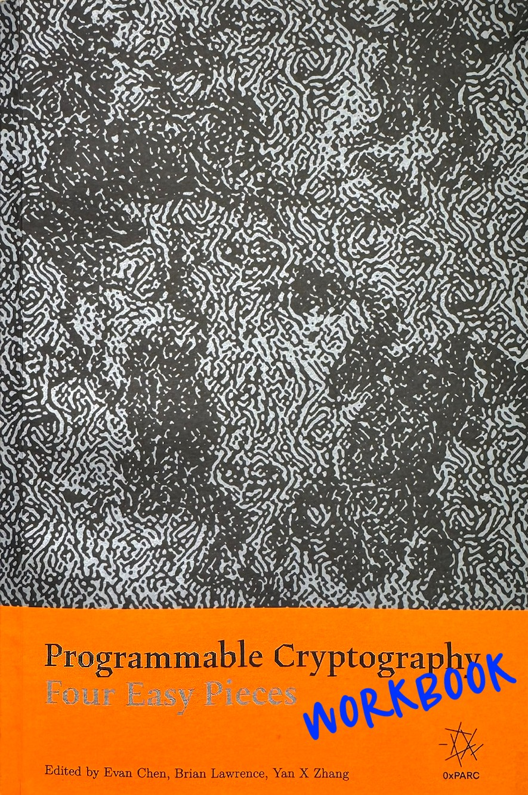

# Introduction to Programmable Cryptography Workbook

<p align="center">
  
</p>

This is a workbook for 0xPARC's [Introduction to Programmable Cryptography](https://github.com/0xPARC/0xparc-intro-book) ([PDF](Four_Easy_Pieces_in_Programmable_Cryptography_2024-09-09.pdf)) book. Its main objective is to help readers follow the book and its concepts. The Jupyter Notebooks directly translate the algorithms and examples mentioned in the book, written in the most straightforward manner possible (i.e., no optimizations).

For Chapter 4, please refer to 0xPARC's [PlonKathon](https://github.com/0xPARC/plonkathon) which contains related exercises. You can also see my PlonKathon [blog post](https://flyingnobita.com/posts/2024/09/29/plonkathon) for hints.

#### Acknowledgement

Thank you to the book's authors, [Evan Chen](https://github.com/vEnhance) and [Brian Lawrence](https://github.com/tideofwords) for their feedback. Thank you to [0xPARC](https://0xparc.org/) for sponsoring this project.

## Running Online

## Running Locally

### How To Install

#### Dependencies

This project's dependencies are managed by [Poetry](https://python-poetry.org/).

##### Install Poetry (if not already installed)

```shell
pipx install poetry
```

If the above doesn't work, see [here](https://python-poetry.org/docs/#installation) for additional instructions on Poetry installation.

##### Install Dependencies with Poetry

```shell
poetry install
```

### How To Run

All notebook files are in the `src` folder and can be run inside a Jupyter Lab environment.

To start JupyterLab:

```bash
jupyter-lab
```

Then open the jupyter notebook files inside the `\src` folder

### How to Test

There are unittest files for certain chapters.

**Run all test files:**

```bash
poetry run pytest
```

**Run test for specifc chapter:**

```bash
poetry run pytest tests/test_ch_6_oram.py
```

## Roadmap

- [x] Code companion to text
  - [x] Ch 2: 2PC
    - [x] 2.1.3 Garbled gates
    - [x] 2.1.4 Chaining garbled gates
    - [x] 2.1.5 How Bob uses one gate
      - [x] Example: How to chain 2 garbled gates
    - [x] 2.2.1 Commutative encryption
    - [x] 2.2.3 OT in one step
      - [x] Example: How to combine garbled circuits and OT
  - [x] Ch 3: EC & PCS
    - [x] 3.2.2 EdDSA Signature Scheme
    - [x] 3.2.3 Pedersen Commitments
    - [x] 3.4 KZG Commitments
  - [x] Ch 5: FHE
    - [x] 5.3 Public Key Cryptography from LWE Example
    - [x] 5.4.3 The "Flatten" Operation
  - [x] Ch 6: ORAM
    - [x] 6.3 Binary Tree ORAM
    - [x] 6.7 Path ORAM
    - Other Ideas:
      - [ ] 6.6 Recursive ORAM
      - [ ] Encryption and decryption on blocks
- [ ] Exercises
